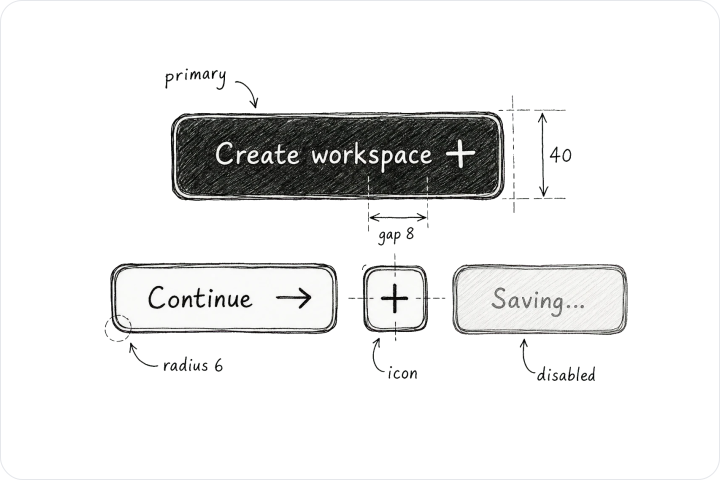
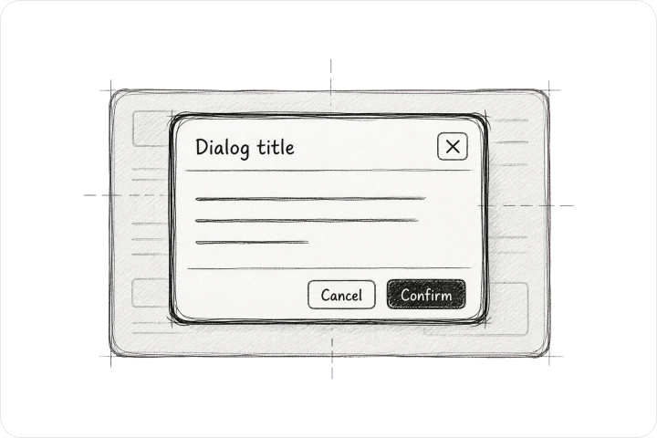
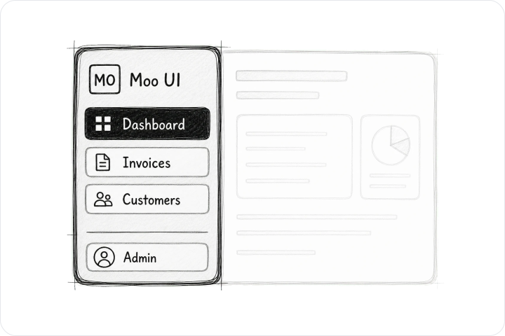
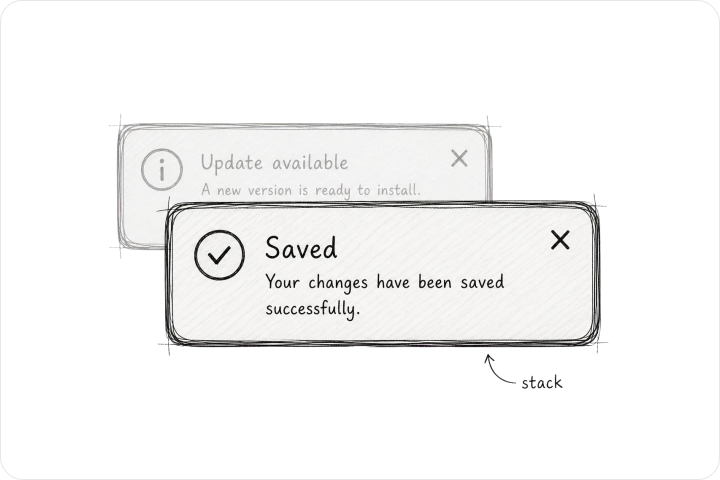
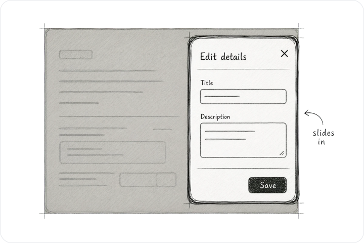
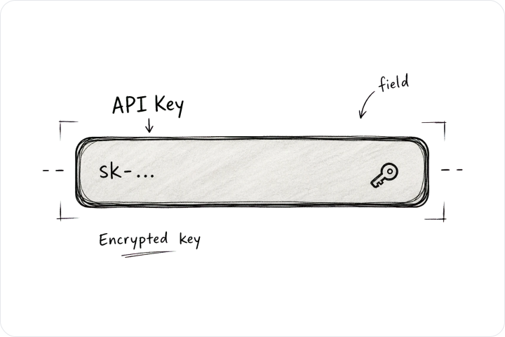

<p align="center">
  
</p>

<p align="center">
  <a href="https://github.com/wpmoo-org/ui/actions/workflows/ui-ci.yml"></a>
  <a href="https://github.com/wpmoo-org/ui"></a>
  <a href="https://www.npmjs.com/package/@wpmoo/ui"></a>
  <a href="LICENSE"></a>
</p>

<p align="center">
  <strong>Bootstrap markup. shadcn feel.</strong>
</p>

<p align="center">
  Keep your Bootstrap 5.3 HTML and behavior. Replace the stylesheet and give
  your application a calmer, modern product interface without moving to React or
  Tailwind.
</p>

<p align="center">
  <a href="https://ui.wpmoo.org/"><strong>Explore Moo UI »</strong></a>
</p>

<p align="center">
  <a href="#try-it-in-30-seconds">Try it in 30 seconds</a> ·
  <a href="https://www.npmjs.com/package/@wpmoo/ui">View on npm</a> ·
  <a href="https://github.com/wpmoo-org/ui/issues">Report bug</a>
</p>

# Moo UI

Moo UI is for teams that already like Bootstrap's durability, documented
components, and server-rendered friendliness, but want their customer portals,
admin screens, and business applications to feel more like modern SaaS
software.

It keeps Bootstrap as the public contract: familiar classes, `data-bs-*`
behavior, CSS variables, Sass customization, and Bootstrap JavaScript plugins.
Moo UI changes the visual language around that contract.

## Try It in 30 Seconds

Drop the stylesheet into ordinary Bootstrap markup:

```html
<link rel="stylesheet"
      href="https://unpkg.com/@wpmoo/ui@0.2.1/dist/assets/css/moo-ui.css">

<button type="button" class="btn btn-primary">Create workspace</button>
```

That is the point of Moo UI: your markup still says Bootstrap, but the surface
feels quieter, sharper, and more product-ready.

## Install

Use the published package when a bundler owns your build:

```bash
npm install @wpmoo/ui
```

```js
import "@wpmoo/ui/moo-ui.css";
```

If a page uses Bootstrap plugins such as Dropdown, Tooltip, Popover, Modal,
Toast, or Offcanvas, load Bootstrap's JavaScript bundle separately through your
application. Tooltip and Popover also need the initialization Bootstrap
documents for those plugins.

## Choose an Adoption Path

| Situation | Use | Contract |
| --- | --- | --- |
| New page or whole application | `moo-ui.css` | Complete Bootstrap CSS build with Moo UI defaults; use it instead of your existing Bootstrap stylesheet. |
| Gradual adoption inside an existing Bootstrap app | `moo.css` | Scoped Moo component layer under a `.moo-ui` boundary for gradual adoption inside an existing Bootstrap app. |

## Why Bootstrap Teams Try It

- **No frontend rewrite.** Keep server-rendered HTML, Bootstrap classes, and
  the component behavior your team already knows.
- **Modern product rhythm.** Buttons, forms, overlays, navigation, data
  display, and app shells are tuned toward a restrained shadcn-inspired feel.
- **Inspectable examples.** The catalog is static HTML. Every component page
  shows rendered examples and copyable markup.
- **Bootstrap-native customization.** Moo UI uses Bootstrap Sass knobs and
  `--bs-*` variables wherever Bootstrap can express the need, adding Moo-owned
  tokens only for gaps Bootstrap does not model.
- **Practical migration surface.** Start with one page, one scoped area, or a
  full stylesheet replacement after visual review.

## Philosophy

- **Bootstrap is the contract.** Moo UI keeps Bootstrap markup, documented
  behavior, Sass knobs, and `--bs-*` variables wherever Bootstrap can express
  the need.
- **shadcn is the feeling.** Moo UI studies restraint, rhythm, and product UI
  sensibility without adopting React, Tailwind, Radix, or shadcn source.
- **HTML stays first-class.** The catalog is static, inspectable, and friendly
  to server-rendered applications.
- **Extensions stay honest.** Moo-owned classes and behavior are added only
  when Bootstrap has no native component contract for the pattern.

## What Is Included

The live catalog is the source of truth for current coverage:

- [Components](https://ui.wpmoo.org/components/) for actions, forms,
  data display, feedback, disclosure, overlays, and navigation.
- [Blocks](https://ui.wpmoo.org/blocks/) for composed application
  surfaces such as sidebar layouts.
- A static documentation site that can be inspected without a client-side app
  runtime.

Representative components include Button, Field, Table, Dialog, Toast, Sheet,
and Sidebar. More components are being added as the catalog roadmap continues.

## Designed, Not Just Restyled

Moo UI uses original sketch-style previews to show the thinking behind each
primitive: states, spacing, hierarchy, and the product UI feeling Bootstrap
projects often need. The README wraps a few of those transparent assets in
theme-aware surfaces so they stay legible on GitHub.

<p align="center">
  <a href="https://ui.wpmoo.org/components/button/">
    <picture>
      <source media="(prefers-color-scheme: dark)" srcset="static/images/readme/button-dark.svg">
      
    </picture>
  </a>
  <a href="https://ui.wpmoo.org/components/dialog/">
    <picture>
      <source media="(prefers-color-scheme: dark)" srcset="static/images/readme/dialog-dark.svg">
      
    </picture>
  </a>
  <a href="https://ui.wpmoo.org/components/sidebar/">
    <picture>
      <source media="(prefers-color-scheme: dark)" srcset="static/images/readme/sidebar-dark.svg">
      
    </picture>
  </a>
  <a href="https://ui.wpmoo.org/components/toast/">
    <picture>
      <source media="(prefers-color-scheme: dark)" srcset="static/images/readme/toast-dark.svg">
      
    </picture>
  </a>
  <a href="https://ui.wpmoo.org/components/sheet/">
    <picture>
      <source media="(prefers-color-scheme: dark)" srcset="static/images/readme/sheet-dark.svg">
      
    </picture>
  </a>
  <a href="https://ui.wpmoo.org/components/input/">
    <picture>
      <source media="(prefers-color-scheme: dark)" srcset="static/images/readme/input-dark.svg">
      
    </picture>
  </a>
</p>

<p align="center">
  <a href="https://ui.wpmoo.org/components/">Browse the full catalog →</a>
</p>

## Package Boundaries

The npm package distributes compiled CSS and license/notice files. It does not
ship the catalog's generated preview images, Jinja templates, Sass source, or
Moo-owned catalog JavaScript.

The source repository contains the static catalog, component templates, build
tooling, tests, and documentation.

## Development

The catalog is intentionally small-tool friendly:

```bash
.venv/bin/python build.py
.venv/bin/python dev.py
.venv/bin/python -m unittest discover -s tests -v
```

For developers who prefer npm scripts, the package also exposes:

```bash
npm run build
npm run dev
npm test
```

Browse the local catalog at `http://localhost:4173/` when `dev.py` is running.

## Licensing

Moo UI source code is licensed under the MIT License by WPMoo (`wpmoo.org`).

WPMoo-generated visual assets, including image assets under `static/images/`,
are not covered by the MIT source code license and remain copyright WPMoo, all
rights reserved.

Vendored third-party material keeps its original license and attribution. See
`LICENSE`, `ASSET_LICENSE.md`, and `THIRD_PARTY_NOTICES.md`.
