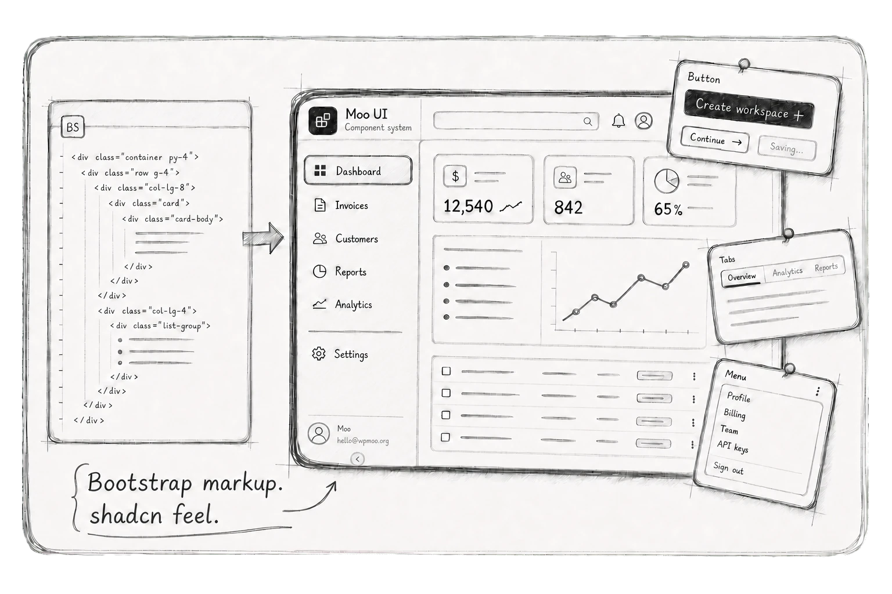

# Moo UI

**Bootstrap markup. shadcn feel.**

Moo UI is a Bootstrap 5.3 component system for teams that want the calm,
modern feel of shadcn/ui without leaving server-rendered HTML, Bootstrap
classes, Bootstrap Sass, or Bootstrap JavaScript behind.

It keeps Bootstrap as the public contract, then shapes the catalog, component
examples, and composed blocks into a quieter product interface language.

## Philosophy

- **Bootstrap is the contract.** Moo UI keeps Bootstrap markup, documented
  behavior, `data-bs-*` APIs, Sass knobs, and `--bs-*` variables wherever
  Bootstrap can express the need.
- **shadcn is the visual language.** Moo UI studies shadcn/ui for restraint,
  spacing, composition, and state language. It does not copy shadcn source,
  React code, Tailwind code, Radix code, or example prose.
- **HTML stays first-class.** Component examples are generated from Jinja
  macros, so the preview and copyable source share one rendered output.
- **No framework adoption tax.** The catalog can be browsed, built, and
  shipped as static HTML without a SPA runtime.
- **Product shells matter.** Moo UI includes primitives, utilities, and
  composed blocks for Bootstrap applications that need to feel like modern
  product software.

## Documentation

Browse the catalog at [ui.wpmoo.org](https://ui.wpmoo.org/). Component pages,
blocks, examples, local development notes, and implementation contracts belong
in the documentation rather than this README.

## Licensing

Moo UI source code is licensed under the MIT License by WPMoo (`wpmoo.org`).

WPMoo-generated visual assets, including image assets under `static/images/`,
are not covered by the MIT source code license and remain copyright WPMoo, all
rights reserved.

Vendored third-party material keeps its original license and attribution. See
`LICENSE`, `ASSET_LICENSE.md`, and `THIRD_PARTY_NOTICES.md`.
